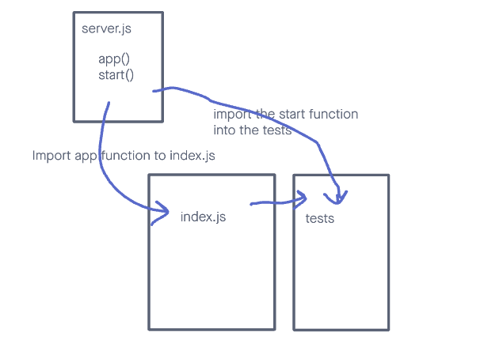

# LAB - 401-D49 Lab-01

## Project: server-deployment-practice

### Author: Lewis Benson

### Problem Domain

create and deploy a web server using CI and CD and get used to the general process of building and deploying servers, and prepping your work for grading

### Links and Resources

- [ci/cd](https://github.com/tm-LBenson/server-deployment-practice/actions) (GitHub Actions)
- [server-prod](https://server-deployment-assignment.onrender.com/)
- [server-dev](https://server-deployment-assignment-dev.onrender.com/)

### Setup

#### `.env` requirements (where applicable)

see `.env.sample`

- PORT=3001

#### How to initialize/run your application (where applicable)

- nodemon

#### Features / Routes

- Feature One: Details of feature
- Feature one: Deploy to Dev
- GET : `/` - specific route to hit
- GET : `/bad` - specific route to hit
- Feature two: Deploy to Prod
- GET : `/` - specific route to hit
- GET : `/bad` - specific route to hit

#### Tests

- How do you run tests?
  - npm test
- Any tests of note?
  - handles root path
  - handles invalid paths
  - handles error code 500
- Describe any tests that you did not complete, skipped, etc

#### UML

Link to an image of the UML for your application and response to events
